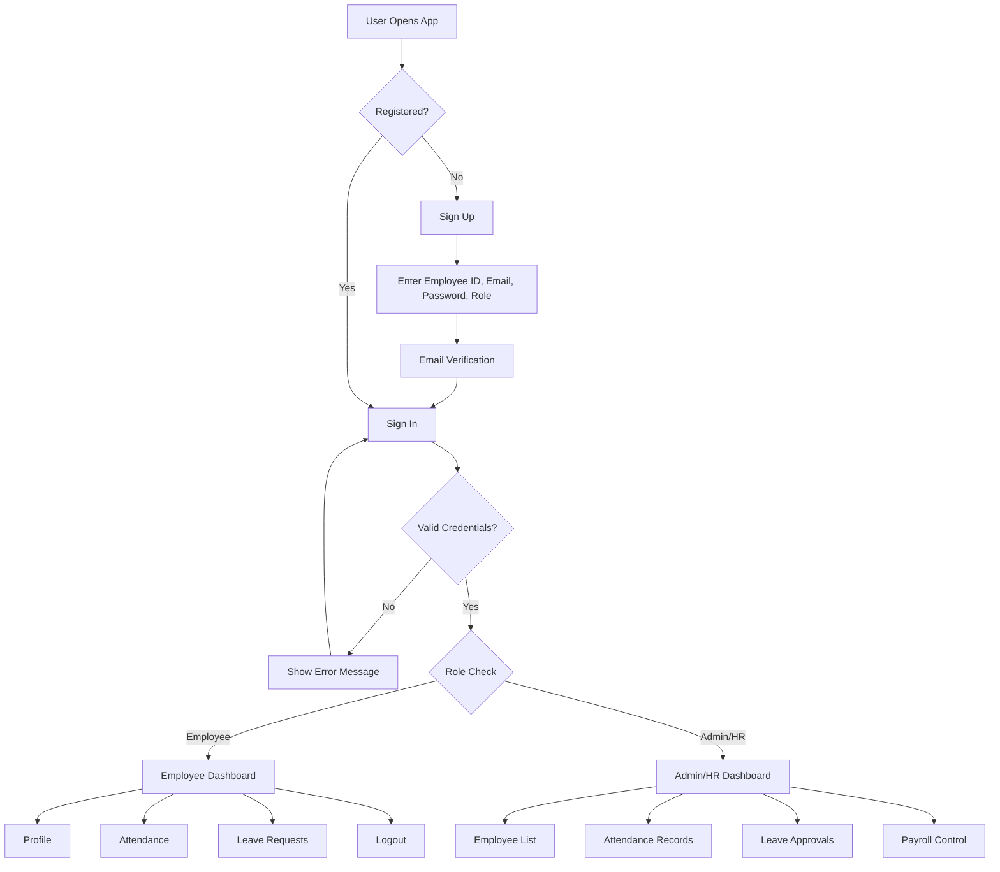
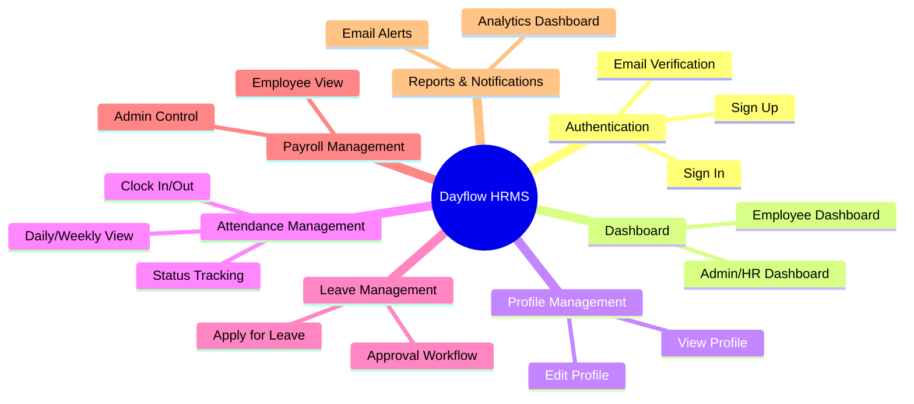
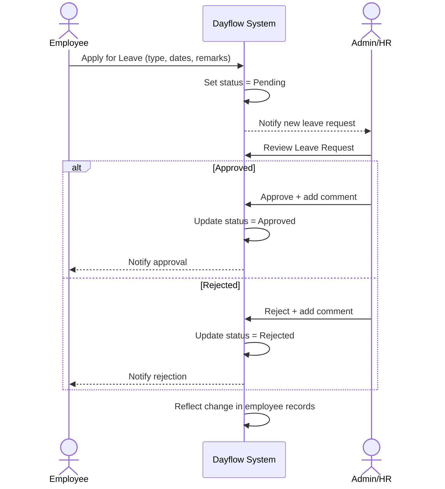
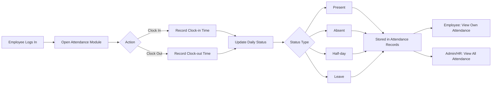
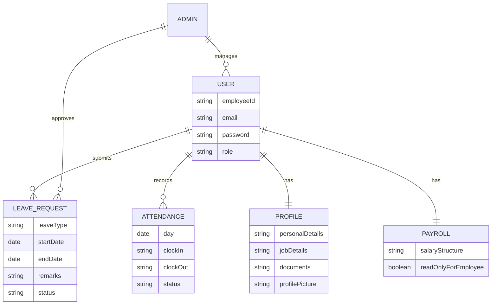

# Dayflow — Human Resource Management System

**Every workday, perfectly aligned.**

A full-stack HRMS application with employee management, attendance tracking, leave management, and payroll features.

---

## Table of Contents

- [Overview](#overview)
- [Tech Stack](#tech-stack)
- [Scope](#scope)
- [User Roles](#user-roles)
- [System Architecture / Flow](#system-architecture--flow)
- [Feature Modules](#feature-modules)
- [Functional Requirements](#functional-requirements)
- [Leave Approval Workflow](#leave-approval-workflow)
- [Attendance Flow](#attendance-flow)
- [Entity Overview](#entity-overview)
- [Prerequisites](#prerequisites)
- [Installation & Setup](#installation--setup)
- [Running the Application](#running-the-application)
- [Default Users](#default-users)
- [Project Structure](#project-structure)
- [Key Features](#key-features)
- [API Endpoints](#api-endpoints)
- [Testing](#testing)
- [Building for Production](#building-for-production)
- [Troubleshooting](#troubleshooting)
- [Environment Variables](#environment-variables)
- [Future Enhancements](#future-enhancements)
- [Design Reference](#design-reference)
- [Contributing](#contributing)
- [License](#license)

---

## Overview

Dayflow aims to replace manual, fragmented HR processes with a single, role-based platform where:

- **Employees** manage their own profile, mark attendance, apply for leave, and view salary details.
- **Admins / HR Officers** manage employees, approve attendance & leave, and control payroll data.

---

##  Tech Stack

Dayflow is built on the **MERN stack** (MongoDB, Express, React, Node).

### Backend
| Technology | Purpose |
|---|---|
| Node.js & Express.js | Runtime & web framework |
| MongoDB with Mongoose | Database & ODM |
| JWT Authentication | Authentication tokens |
| bcryptjs | Password hashing |

### Frontend
| Technology | Purpose |
|---|---|
| React 19 with Vite | UI framework / build tool & dev server |
| React Router DOM v7 | Client-side routing |
| Tailwind CSS | Utility-first styling |
| Axios | HTTP requests to backend |
| React Hot Toast | Notifications / toasts |
| Lucide React | Icon library |
| TanStack React Query | Data fetching |

### Architecture
- **MERN Stack** — MongoDB, Express, React, Node
- **REST API** — backend exposes JSON endpoints
- **Mock data layer** — frontend also includes local mock data (`src/data/`) for development without the backend

---

## Scope

The HRMS provides:

-  Secure Authentication (Sign Up / Sign In)
-  Role-based Access (Admin vs Employee)
-  Employee Profile Management
-  Attendance Tracking (daily / weekly view)
-  Leave & Time-Off Management
-  Approval Workflows for HR / Admin

---

## User Roles

| User Type | Description |
|---|---|
| **Admin / HR Officer** | Manages employees, approves leave & attendance, views payroll details |
| **Employee** | Views personal profile, attendance, applies for leave, views salary details |

**Definitions:**
- **Admin / HR Officer** — User with management and approval privileges
- **Employee** — Regular user with limited access
- **Time-Off** — Paid leave, sick leave, unpaid leave, etc.

---

## System Architecture / Flow

High-level flow of how a user moves through the system from authentication to role-based dashboards:



---

## Feature Modules



---

## Functional Requirements

### 1. Authentication & Authorization
- **Sign Up:** Employee ID, Email, Password, Role (Employee/HR); password security rules enforced; email verification required.
- **Sign In:** Login with email & password; incorrect credentials show an error; successful login redirects to the dashboard.

### 2. Dashboard
- **Employee Dashboard:** Quick-access cards — Profile, Attendance, Leave Requests, Logout — plus recent activity/alerts.
- **Admin/HR Dashboard:** Employee list, attendance records, leave approvals, and the ability to switch between employees.

### 3. Employee Profile Management
- **View Profile:** Personal details, job details, salary structure, documents, profile picture.
- **Edit Profile:** Employees can edit limited fields (address, phone, profile picture). Admin can edit all employee details.

### 4. Attendance Management
- **Tracking:** Daily and weekly views; clock-in/clock-out for employees.
- **Status Types:** Present, Absent, Half-day, Leave.
- **Visibility:** Employees see only their own attendance; Admin/HR sees all employees' attendance.

### 5. Leave & Time-Off Management
- **Apply for Leave (Employee):** Select leave type (Paid, Sick, Unpaid), choose date range, add remarks. Status: Pending, Approved, Rejected.
- **Leave Approval (Admin/HR):** View all requests, approve/reject, add comments. Changes reflect immediately in employee records.

### 6. Payroll / Salary Management
- **Employee View:** Payroll data is read-only.
- **Admin Control:** View payroll of all employees, update salary structure, ensure payroll accuracy.

### 7. Reports & Notifications
- Email & notification alerts.
- Analytics & reports dashboard (e.g., salary slips, attendance reports).

---

## Leave Approval Workflow



---

## Attendance Flow



---

## Entity Overview



---

##  Prerequisites

Before you begin, ensure you have the following installed:
- Node.js (v16 or higher)
- MongoDB (local installation or MongoDB Atlas account)
- npm or yarn package manager

---

##  Installation & Setup

### 1. Clone the Repository
```bash
git clone <repository-url>
cd OdooHackathon
```

### 2. Backend Setup

```bash
# Navigate to backend directory
cd backend

# Install dependencies
npm install

# Create .env file from example
copy .env.example .env

# Edit .env file with your configuration
# Required variables:
# - MONGODB_URI: Your MongoDB connection string
# - JWT_SECRET: A secure random string for JWT signing
# - PORT: Server port (default: 5000)
# - FRONTEND_URL: Frontend URL for CORS (default: http://localhost:5173)
```

**Example .env configuration:**
```env
NODE_ENV=development
PORT=5000
MONGODB_URI=mongodb://localhost:27017/hrms_db
JWT_SECRET=your_super_secret_jwt_key_change_this_in_production
FRONTEND_URL=http://localhost:5173
```

### 3. Frontend Setup

```bash
# Navigate to frontend directory
cd ../frontend/hrms-frontend

# Install dependencies
npm install

# Create .env file from example
copy .env.example .env

# The .env file should contain:
# VITE_API_URL=http://localhost:5000/api
```

---

##  Running the Application

### Start MongoDB
Make sure MongoDB is running on your system:
```bash
# Windows (if installed as service)
net start MongoDB

# Or using mongod
mongod --dbpath <path-to-your-data-directory>
```

### Start Backend Server
```bash
# From the backend directory
cd backend

# Development mode with auto-reload
npm run dev

# Or production mode
npm start
```

The backend server will start on `http://localhost:5000`

### Start Frontend Development Server
```bash
# From the frontend directory
cd frontend/hrms-frontend

# Start development server
npm run dev
```

The frontend will start on `http://localhost:5173`

---

## 👥 Default Users

The system comes with pre-configured users for testing:

### Admin Account
- **Email:** admin@hrms.com
- **Password:** admin123
- **Role:** Admin (full access)

### Employee Account
- **Email:** john.doe@hrms.com
- **Password:** password123
- **Role:** Employee (limited access)

---

##  Project Structure

### Backend Structure
```
backend/
├── config/          # Database configuration
├── controllers/     # Route controllers
├── middleware/      # Custom middleware (auth, validation, error)
├── models/          # MongoDB models
├── routes/          # API routes
├── services/        # Business logic services
├── utils/           # Utility functions
├── app.js           # Express app configuration
└── server.js        # Server entry point
```

### Frontend Structure
```
frontend/hrms-frontend/
├── public/          # Static assets
├── src/
│   ├── assets/      # Images and icons
│   ├── components/  # Reusable components
│   ├── context/     # React context providers
│   ├── data/        # Mock data (for development)
│   ├── hooks/       # Custom React hooks
│   ├── layout/      # Layout components
│   ├── pages/       # Page components
│   ├── routes/      # Route configuration
│   ├── services/    # API service layer
│   ├── utils/       # Utility functions
│   ├── App.jsx      # Main app component
│   └── main.jsx     # Entry point
└── vite.config.js   # Vite configuration
```

---

##  Key Features

### For All Users
-  User authentication (login/signup)
-  Profile management
-  Dashboard with analytics

### For Employees
-  Clock in/out functionality
-  View attendance history
-  Apply for leave
-  View leave status
-  View employee directory

### For Admins/HR
-  Manage all employees
-  View all attendance records
-  Approve/reject leave requests
-  Manage payroll and salaries
-  View comprehensive analytics
-  Add/edit/delete users

---

##  API Endpoints

### Authentication
- `POST /api/auth/register` - Register new user
- `POST /api/auth/login` - User login

### Users
- `GET /api/users/profile` - Get current user profile
- `PUT /api/users/profile` - Update profile
- `GET /api/users/:id` - Get user by ID

### Attendance
- `GET /api/attendance/my-attendance` - Get my attendance
- `GET /api/attendance/today` - Get today's attendance
- `POST /api/attendance/clock-in` - Clock in
- `POST /api/attendance/clock-out` - Clock out

### Leave
- `GET /api/leave/my-leaves` - Get my leave requests
- `POST /api/leave/apply` - Apply for leave

### Admin Routes
- `GET /api/admin/users` - Get all users
- `PUT /api/admin/users/:id` - Update user
- `DELETE /api/admin/users/:id` - Delete user
- `GET /api/admin/attendance` - Get all attendance
- `GET /api/admin/leaves` - Get all leave requests
- `PUT /api/admin/leaves/:id` - Approve/reject leave
- `GET /api/admin/payroll` - Get all payroll
- `GET /api/admin/stats` - Get dashboard statistics

---

##  Testing

### Backend Testing
```bash
cd backend
npm test
```

### Frontend Testing
```bash
cd frontend/hrms-frontend
npm run lint
```

---

##  Building for Production

### Backend
```bash
cd backend
# Set NODE_ENV to production in .env
npm start
```

### Frontend
```bash
cd frontend/hrms-frontend
npm run build
# Built files will be in the 'dist' directory
npm run preview  # Preview production build
```

---

##  Troubleshooting

### MongoDB Connection Issues
- Ensure MongoDB is running
- Check your `MONGODB_URI` in the backend `.env` file
- Verify network connectivity if using MongoDB Atlas

### CORS Errors
- Verify `FRONTEND_URL` in backend `.env` matches your frontend URL
- Check that the backend server is running
- Clear browser cache and cookies

### Authentication Issues
- Clear localStorage in browser developer tools
- Verify JWT_SECRET is set in backend `.env`
- Check that the token is being sent in request headers

### Port Already in Use
```bash
# Windows - Kill process on port 5000
netstat -ano | findstr :5000
taskkill /PID <PID> /F

# Or change the PORT in backend .env file
```

---

## 📝 Environment Variables

### Backend (.env)
| Variable | Description | Example |
|----------|-------------|---------|
| NODE_ENV | Environment mode | development |
| PORT | Server port | 5000 |
| MONGODB_URI | MongoDB connection string | mongodb://localhost:27017/hrms_db |
| JWT_SECRET | Secret for JWT signing | your_secret_key |
| FRONTEND_URL | Frontend URL for CORS | http://localhost:5173 |

### Frontend (.env)
| Variable | Description | Example |
|----------|-------------|---------|
| VITE_API_URL | Backend API base URL | http://localhost:5000/api |

---

## Future Enhancements

- [ ] Advanced analytics & reporting (salary slips, attendance summaries)
- [ ] Push/email notification improvements
- [ ] Mobile app support
- [ ] Integration with third-party payroll systems
- [ ] Document management enhancements

> This section will be expanded as the project scope evolves.

---

## Design Reference

Wireframes / system design sketches: [Excalidraw Diagram](https://link.excalidraw.com/l/65VNwvy7c4X/58RLEJ4oOwh)

---

##  Contributing

1. Fork the repository
2. Create your feature branch (`git checkout -b feature/amazing-feature`)
3. Commit your changes (`git commit -m 'Add some amazing feature'`)
4. Push to the branch (`git push origin feature/amazing-feature`)
5. Open a Pull Request

---

##  License

This project is licensed under the ISC License.

##  Author

Created for Odoo Hackathon

##  Support

For issues and questions, please create an issue in the repository.
